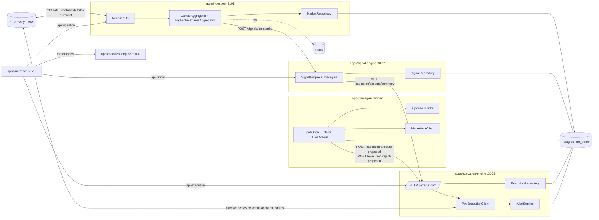

# PHASE 0 PLAN — Architecture Baseline

> **Zakres Fazy 0:** wyłącznie audyt architektury i przygotowanie planu Fazy 1
> (Execution Security). Faza 0 **nie zmienia zachowania tradingowego ani
> semantyki `execution-engine`**. Ten dokument jest wejściem do dyskusji
> i uzyskania akceptacji przed rozpoczęciem implementacji.

Data: 2026-07-10
Roadmap: [ROADMAP.md](ROADMAP.md)
Konstytucja: [../../AGENTS.md](../../AGENTS.md)

---

## 1. Podsumowanie

Repo `ikbr-trader` to monorepo pnpm z 6 usługami (`apps/*`) + współdzielony
pakiet `packages/shared`. Wszystkie usługi łączy jedna baza Postgres (+ Redis
dla cache market state) oraz jedna zewnętrzna zależność I/O — **TWS/IB Gateway**
przez pakiet `ib@^0.2.8`. LLM-agent to worker pollingujący `proposed_orders`;
UI to React SPA proxujący HTTP do backendów. **Execution-engine jest jedynym
miejscem w kodzie, które składa lub anuluje zlecenia u brokera.**

Faza 0 kończy się:
- udokumentowaną architekturą (poniżej),
- udokumentowanym przepływem danych,
- weryfikacją komend `build` / `lint` / `typecheck` / `test` w root,
- listą i kolejnością zmian oraz kryteriami akceptacji dla Fazy 1.

Faza 0 **nie** modyfikuje żadnego pliku kodu produkcyjnego. Jedyne dopuszczone
zmiany na tym etapie to nowe pliki w `docs/implementation/`.

---

## 2. Obecna architektura

### 2.1 Usługi (workspace `pnpm`)

| App | Port | Rola | Wchodzi w IBKR? |
| --- | --- | --- | --- |
| [apps/ingestion](../../apps/ingestion) | 3101 | subskrypcja `reqMktData`, agregacja świec (1m→5m/1h/4h/12h/1d/1w), persistence, publikacja `/signals/on-candle` | TAK (tylko market data + contract lookup + historical) |
| [apps/signal-engine](../../apps/signal-engine) | 3102 | wskaźniki, regime detection, strategie, risk engine, wpis `proposed_orders (status=PROPOSED)` | NIE |
| [apps/execution-engine](../../apps/execution-engine) | 3103 | **jedyne** miejsce: `placeOrder`, `cancelOrder`, `reqAccountUpdates`, `reqExecutions`, reconciliation | **TAK (jedyne)** |
| [apps/llm-agent](../../apps/llm-agent) | — | worker pollujący `proposed_orders`, decyzja EXECUTE/REJECT przez OpenAI + Marketaux, wywołuje `execution-engine` HTTP | NIE |
| [apps/backtest-engine](../../apps/backtest-engine) | 3104 | osobna DB `ikbr_trader_backtest`, historical fetch + simulator + strategy lab | TAK (tylko `reqContractDetails`, `reqHistoricalData` — bez zleceń) |
| [apps/ui](../../apps/ui) | 5173 | React/Vite; proxuje `/api/{ingestion,signal,execution,backtest}` do backendów | NIE |
| `postgres` | 5432 | DB `ikbr_trader` (live) + `ikbr_trader_backtest` | NIE |
| `redis` | 6379 | cache `MarketState` per conid | NIE |

Współdzielone typy i schematy: [packages/shared/src/index.ts](../../packages/shared/src/index.ts)
(`SignalTicket`, `ProposedOrder`, `ProposedOrderStatus`, `PositionEffect`,
`DecisionSource`, `AiDecision`, `IndicatorSnapshot`, itd.).

### 2.2 Deployment

Wszystko dockeryzowane w [docker-compose.yml](../../docker-compose.yml).
Kontenery `ingestion`, `execution-engine`, `backtest-engine` łączą się z TWS
przez `host.docker.internal:${IB_SOCKET_PORT}` (`extra_hosts: host-gateway`).
UI proxuje przez Vite do sąsiednich kontenerów po nazwie serwisu.

### 2.3 Bazy danych — mapa krótko

- **Live** DB `ikbr_trader`: seed z [infra/sql/001_init.sql](../../infra/sql/001_init.sql),
  reszta migracji **inline w kodzie** (runtime `init()` w każdym repository).
- **Backtest** DB `ikbr_trader_backtest`: tworzona i migrowana w
  [apps/backtest-engine/src/repository.ts](../../apps/backtest-engine/src/repository.ts)
  z prefiksem `backtest_*`.

Pełny inwentarz tabel — sekcja 5.

---

## 3. Przepływ danych (data flow)

### 3.1 Diagram wysokiego poziomu



### 3.2 Trasa jednego sygnału (happy path)

1. `ingestion` odbiera tick z TWS → agreguje świecę 1m → upsert do
   `candles_1m` (+ agregaty 5m/1h/4h/12h/1d/1w) → `POST /signals/on-candle`
   do signal-engine.
2. `signal-engine` liczy wskaźniki i regime, uruchamia strategie, wpisuje
   `proposed_orders (status='PROPOSED', decision_source='signal')`.
3. `llm-agent` (jeśli `LLM_AGENT_ENABLED=true`) claim'uje wiersz
   (`processing_owner`, `processing_claimed_at`), pobiera newsy i decyduje.
4. Dla `EXECUTE` → `POST /execution/execute-proposed/:id`;
   dla `REJECT` → `POST /execution/reject-proposed/:id`.
5. `execution-engine` waliduje ticket, sprawdza kill-switch + kolizję z aktywnym
   `SUBMITTED`, buduje plan bracket (parent LMT/MKT/STP + TP LMT + STP/TRAIL,
   z opcjonalnym laddered OCA), wywołuje `ib.placeOrder(...)`, aktualizuje
   `proposed_orders` (`SUBMITTED` / `FILLED` / `CANCELLED` / `REJECTED`),
   zapisuje `broker_execution_fills` i `system_alerts`.
6. UI odpytuje `/execution/orders`, `/execution/trades`,
   `/execution/account/summary`, `/execution/kill-switch`.

### 3.3 Cykl życia zlecenia (state machine `proposed_orders.status`)

Domena: `PROPOSED | REJECTED | SUBMITTED | FILLED | CANCELLED | SUPERSEDED | EXPIRED`
([packages/shared/src/index.ts](../../packages/shared/src/index.ts) — `ProposedOrderStatus`).

- **PROPOSED** — insert przez signal-engine (`decision_source='signal'`) albo
  przez `execution-engine` (`execute-ticket` z `persist=true`).
- **PROPOSED → SUPERSEDED** — signal-engine wygenerował nowszy sygnał dla tego
  samego instrumentu (`supersedePendingSignalsForInstrument`).
- **PROPOSED → EXPIRED** — signal-engine `expireStalePendingSignals` po TTL.
- **PROPOSED → REJECTED** — llm-agent lub user, przez
  `POST /execution/reject-proposed/:id` → `repo.markRejected`.
- **PROPOSED → SUBMITTED** — udany `placeOrder` (`markSubmitted`).
- **PROPOSED → FILLED** — `placeOrder` zwraca `FILLED` natychmiast
  (`markFilled`), lub reconciliation z `broker_execution_fills`.
- **SUBMITTED → FILLED** — event `orderStatus=FILLED` z TWS → `applyBrokerStatusUpdate`.
- **SUBMITTED → CANCELLED** — `POST /execution/cancel-proposed/:id`,
  auto-cancel po SUBMITTED-timeout, kod 10147, kod 404 (locate-held).
- **REJECTED → SUBMITTED** — możliwy tylko przez `overrideRejected=true`
  z aktorem `user_override`.

---

## 4. Miejsca komunikacji z IBKR (audyt zleceniowy)

Cała komunikacja socketowa z TWS wykorzystuje pakiet `ib@^0.2.8`.
Poniżej pełna lista miejsc dotykających brokera — z podziałem na role:

### 4.1 Zdolność do składania, modyfikacji, anulowania lub zamykania zlecenia

**Jedyne miejsce (single source of writes):**
[apps/execution-engine/src/tws-execution-client.ts](../../apps/execution-engine/src/tws-execution-client.ts)

| Wywołanie IB API | Linia (ok.) | Efekt zleceniowy |
| --- | --- | --- |
| `ib.placeOrder(orderId, contract, order)` | ~580 | tworzy parent + dzieci bracket (LMT/STP/TRAIL, OCA type=2, TIF z `EXECUTION_DEFAULT_TIF`) |
| `ib.cancelOrder(orderId)` | ~671 | anulowanie pojedynczego zlecenia (używane też do auto-cancel locate-held i submitted-timeout) |
| `ib.reqAccountUpdates(true/false, accountId)` | ~700, ~800 | snapshot metryk i pozycji (read-only) |
| `ib.reqExecutions(reqId, filter)` | ~876 | synchronizacja `broker_execution_fills` (read-only) |
| `ib.reqManagedAccts()` | ~347 | ustala `accountId` (read-only) |
| `ib.reqContractDetails(reqId, contract)` | ~depths — 2× w resolveContract | rozwiązanie conId + minTick (read-only) |
| `ib.reqIds`/`nextValidId` (event) | ~301 | seed `nextOrderId` (read-only) |
| Event `onError` w `bindCoreListeners` | ~ | auto-cancel locate-held (code=404) — **wywołuje `cancelBrokerOrder`** |
| Timer `submittedAutoCancel` | ~ | auto-cancel po `EXECUTION_SUBMITTED_AUTO_CANCEL_MS` — **wywołuje `cancelBrokerOrder`** |

**Brak jakichkolwiek innych miejsc w kodzie repo, które składają lub anulują
zlecenia.** Potwierdzone globalnym `grep`:

```
grep 'ib.(placeOrder|cancelOrder|reqGlobalCancel)' apps → tylko tws-execution-client.ts
```

`ingestion` i `backtest-engine` używają wyłącznie:
- `reqMktData` / `cancelMktData` / `reqMarketDataType`
  ([apps/ingestion/src/tws-client.ts](../../apps/ingestion/src/tws-client.ts)),
- `reqContractDetails` / `reqHistoricalData`
  ([apps/backtest-engine/src/historical-client.ts](../../apps/backtest-engine/src/historical-client.ts)),
- `reqManagedAccts` (read-only).

### 4.2 Warstwa HTTP wystawiona przez `execution-engine`

Wszystkie endpointy w [apps/execution-engine/src/index.ts](../../apps/execution-engine/src/index.ts):

| Metoda | Ścieżka | Skutek |
| --- | --- | --- |
| GET | `/health` | status socketu (read-only) |
| GET | `/execution/kill-switch` | evaluacja daily-loss (read-only) |
| POST | `/execution/reconciliation` | pull `reqAccountUpdates` + porównanie z DB (read-only wobec brokera) |
| GET | `/execution/alerts` | odczyt `system_alerts` |
| POST | `/execution/alerts/test` | dopisuje testowy alert |
| POST | `/execution/bootstrap` | connect socket + ustawia `accountId` |
| GET | `/execution/account/summary` | snapshot konta i pozycji |
| GET | `/execution/orders` | lista `proposed_orders` |
| GET | `/execution/trades` | FIFO-matched `broker_execution_fills` |
| **POST** | **`/execution/execute-proposed/:id`** | **place bracket** (write) |
| POST | `/execution/reject-proposed/:id` | zmiana statusu na REJECTED (DB only) |
| **POST** | **`/execution/cancel-proposed/:id`** | **cancel bracket** (write) |
| **POST** | **`/execution/execute-ticket`** | wstawia PROPOSED + place, **lub** `persist=false` → place bezpośrednio (write, **bez risk-engine, bez proposal flow**) |

**⚠️ Do rewizji w Fazie 1:**
- `POST /execution/execute-ticket` z `persist=false` omija w praktyce
  `proposed_orders` — narusza AGENTS.md „Never bypass proposal flow".
- `MKT` jest domyślną wartością `orderType` w `ticketSchema` (`.default("MKT")`).
- Cały serwis nasłuchuje na `host: "0.0.0.0"` (Fastify) bez auth.

Endpointy pozostałych serwisów (nie dotykają IBKR):

- **ingestion:** `/health`, `/watchlist`, `/backfill-progress`, `POST /bootstrap`, `POST /stop`.
- **signal-engine:** `/health`, `POST /signals/run-once`, `POST /signals/on-candle`,
  `GET /signals/recent`, `POST /signals/outcomes/refresh`,
  `GET /signals/outcomes/summary`, `GET /signals/report`,
  `GET /signals/strategies`, `POST /signals/strategies/:strategyId`.
- **backtest-engine:** `/health`, `/backtest/dataset`, `POST /backtest/history`,
  `POST /backtest/history/symbols`, `POST /backtest/history/resume`,
  `GET /backtest/runs`, `POST /backtest/run`, `GET /backtest/report`.
- **llm-agent:** brak HTTP (worker).

---

## 5. Tabele DB i migracje

### 5.1 Live DB (`ikbr_trader`)

Kanoniczny seed: [infra/sql/001_init.sql](../../infra/sql/001_init.sql).
Reszta migracji dodawana w runtime w metodach `init()` — świadoma niedoskonałość,
którą przyjmujemy jako aktualny stan (nie zmieniamy w Fazie 0).

| Tabela | Właściciel init() | Źródło prawdy dla |
| --- | --- | --- |
| `candles_1m`, `candles_5m`, `candles_1h`, `candles_4h`, `candles_12h`, `candles_1d`, `candles_1w` | ingestion + signal-engine (oba tworzą warunkowo) | świece OHLCV |
| `instrument_contracts` | ingestion + signal-engine | resolved conId/minTick per symbol |
| `proposed_orders` | signal-engine + execution-engine (oba dopisują `ALTER … IF NOT EXISTS`) | cykl życia lokalnych zleceń |
| `signal_outcomes` | signal-engine | ex-post PnL/hit-stop/hit-TP per proposal |
| `strategy_runtime_state` | signal-engine | włączenie/cooldown per strategia |
| `llm_order_decisions` | llm-agent | audyt decyzji AI |
| `broker_execution_fills` | execution-engine | **broker fills (SoR wraz z IBKR)** |
| `system_alerts` | execution-engine | alerty operacyjne |

Backup: `backups/backtest-history-ready-2025-05-08_2026-05-07.dump`
(używany do bootstrapu backtest DB).

### 5.2 Backtest DB (`ikbr_trader_backtest`)

Kanoniczne: `apps/backtest-engine/src/repository.ts`.
Tabele: `backtest_datasets`, `backtest_candles_{1m,5m,1h,4h,12h,1d,1w}`,
`backtest_fx_rates`, `backtest_instrument_contracts`, `backtest_runs`,
`backtest_orders`, `backtest_fills`, `backtest_strategy_state`.

### 5.3 Stan migracji

- Brak dedykowanego narzędzia migracji (nie ma `prisma`, `knex`, `node-pg-migrate`).
- Seed `001_init.sql` **nie** obejmuje: `llm_order_decisions`, `system_alerts`,
  `broker_execution_fills`, `strategy_runtime_state`, `partial_take_profits`,
  `trailing_stop_pct`, `trailing_stop_activation_r`. Wszystkie te obiekty
  są tworzone w runtime.

**Faza 0 nie zmienia tego stanu.** Konsolidacja SQL jest w gestii późniejszej fazy
(nie ma jej na liście Fazy 1).

---

## 6. Źródła prawdy (Sources of Truth)

Zgodnie z AGENTS.md — IBKR jest źródłem prawdy dla positions, orders,
executions, account state. Doprecyzowanie per artefakt:

| Artefakt | Broker (IBKR) | Lokalny (DB) | Notatka |
| --- | --- | --- | --- |
| Pozycje | **SoT: IBKR** (`reqAccountUpdates` → `updatePortfolio`) | `broker_execution_fills` (rekonstrukcja FIFO) | reconciliation w `runReconciliation()` |
| Zlecenia broker | **SoT: IBKR** (`orderStatus`, `openOrders`) | `proposed_orders.broker_order_id` + `execution_message` | lokal śledzi tylko wysłane sygnały |
| Egzekucje / fills | **SoT: IBKR** (`execDetails`, `commissionReport`) | `broker_execution_fills` | seed przez `syncExecutions(since=-30d)` |
| Realized PnL | **SoT: IBKR (per fill)** | agregat z `broker_execution_fills.commission + realized_pnl` w base currency | używa FX z ostatniego snapshotu; braki liczone w `missingFxRates` |
| Account metrics (equity/buying power) | **SoT: IBKR** | cache 10 s w pamięci (`accountSnapshotCache`) | brak persistencji |
| Świece OHLCV | **SoT: DB `candles_*`** (build z ticków + native historical) | `candles_*` | native TF backfill z `reqHistoricalData` nadpisuje |
| Sygnały strategii | **SoT: DB `proposed_orders`** | — | signal-engine generuje event-driven |
| Propozycje (proposed orders) | **SoT: DB `proposed_orders`** | — | mutowane przez signal-engine + execution-engine + llm-agent |
| Decyzje LLM | **SoT: DB `llm_order_decisions`** | — | write-once + `source_error` update |
| Alerty | **SoT: DB `system_alerts`** | — | Telegram jest sinkiem, nie SoT |
| Wskaźniki (per symbol/TF) | **derywowane** z `candles_*` | snapshot w `proposed_orders.indicator_snapshot` (JSONB) | audit trail decyzji |
| Kill-switch | **derywowany** z `broker_execution_fills` + snapshotu konta | — | brak persistencji stanu, przeliczany na żądanie |

---

## 7. Paper vs Live — założenia i luki

AGENTS.md wymaga:
- „Business logic must remain identical."
- „Environment changes ONLY through configuration."
- „Never identify environment using only port numbers."
- Wymagane zmienne: `IBKR_ENVIRONMENT`, `ALLOWED_ACCOUNT_IDS`, `TRADING_MODE`, `TRADING_ENABLED`.

> **Decyzja Fazy 1 (sekcja 18):** zamiast pojedynczej listy
> `ALLOWED_ACCOUNT_IDS` rozdzielamy na dwa envy: `ALLOWED_PAPER_ACCOUNTS`
> i `ALLOWED_LIVE_ACCOUNTS`. Każde write-action w execution-engine musi
> potwierdzić, że aktywny account znajduje się w liście odpowiadającej
> `IBKR_ENVIRONMENT`.

Stan obecny:

| Kryterium | Status |
| --- | --- |
| `IBKR_ENVIRONMENT` | ❌ Brak w `.env.example`, brak w schemas `zod` |
| `ALLOWED_PAPER_ACCOUNTS` / `ALLOWED_LIVE_ACCOUNTS` | ❌ Jest tylko `IBKR_ACCOUNT_ID` (pojedynczy string) w [apps/execution-engine/src/config.ts](../../apps/execution-engine/src/config.ts) |
| `TRADING_MODE` | ❌ Brak |
| `TRADING_ENABLED` | ❌ Brak (istnieje `LLM_AGENT_ENABLED`, ale to inne pojęcie) |
| Environment inferred by port only | ⚠️ TAK — komentarz w `.env.example`: „4002 = paper, 4001 = live" (nie ma niezależnej weryfikacji) |
| Business logic identical paper/live | ✅ TAK — brak rozgałęzień per-env w kodzie |
| Guard „paper only" na warstwie API | ❌ Brak |

**Wniosek dla Fazy 1:** to jeden z fundamentów Execution Security. Musi dojść
walidacja envu przy starcie execution-engine oraz na każdym write endpoint
przed dotknięciem TWS.

---

## 8. Root scripts — luka do wypełnienia w Fazie 1

AGENTS.md wymaga uruchomienia:
```
pnpm lint
pnpm typecheck
pnpm test
pnpm build
```

Stan obecny w [package.json](../../package.json):

| Skrypt root | Istnieje? | Uwagi |
| --- | --- | --- |
| `build` | ✅ `pnpm -r build` | działa (per-workspace `tsc -p tsconfig.json`) |
| `lint` | ❌ **Brak** | brak też per-workspace, brak ESLint config w repo |
| `typecheck` | ❌ **Brak** | pośrednio pokrywany przez `build`, ale bez `--noEmit` |
| `test` | ❌ **Brak w root** | jedyny `test` jest w `apps/signal-engine` (`node --import tsx --test src/**/*.test.ts`) — 5 plików `*.test.ts` |

**Decyzja Fazy 1** (patrz sekcja 18):
- dodać root `typecheck` = `pnpm -r --parallel exec tsc -p tsconfig.json --noEmit` (albo równoważnik per-workspace),
- dodać root `test` = `pnpm -r --if-present test` (obecnie odpali tylko signal-engine),
- root `build` już istnieje,
- **ESLint pozostaje odłożony poza Fazę 1** — Faza 1 wymaga wyłącznie `build`, `typecheck`, `test`. Wprowadzenie `lint` będzie zadaniem osobnej, jawnie dedykowanej fazy (nie jest to element Execution Security).

**Faza 0 nie dodaje tych skryptów.** Weryfikuję jedynie ich brak.

Weryfikacja komend w Fazie 0 (do wykonania po akceptacji planu, przed Fazą 1):

```
pnpm install --frozen-lockfile   # sanity
pnpm -r build                    # ma przejść bez zmian
pnpm --filter @ikbr/signal-engine test  # 5 testów jednostkowych
```

---

## 9. Miejsca wymagające zmian w Fazie 1 (Execution Security)

Zgodnie z ROADMAP.md, Faza 1 obejmuje:

> API authentication • localhost by default • Paper/Live verification •
> Remove unsafe execution paths • Disable default market orders

Zmapowałem to na pliki:

### 9.1 API authentication + localhost binding

**Schemat autoryzacji:** nagłówek `Authorization: Bearer <token>` (patrz sekcja 18).

- [apps/execution-engine/src/index.ts](../../apps/execution-engine/src/index.ts) — `app.listen({ host: "0.0.0.0" })` na porcie 3103; dodać `EXECUTION_BIND_HOST` (default `127.0.0.1`) + `preHandler` weryfikujący `Authorization: Bearer <EXECUTION_API_TOKEN>` (wyjątek: `/health`).
- [apps/execution-engine/src/config.ts](../../apps/execution-engine/src/config.ts) — nowe pola: `EXECUTION_BIND_HOST`, `EXECUTION_API_TOKEN`.
- [apps/llm-agent/src/execution-api-client.ts](../../apps/llm-agent/src/execution-api-client.ts) — dołączenie `Authorization: Bearer ...` do każdego requestu.
- [apps/llm-agent/src/config.ts](../../apps/llm-agent/src/config.ts) — nowe pole `LLM_AGENT_EXECUTION_API_TOKEN`.
- [apps/signal-engine/src/repository.ts](../../apps/signal-engine/src/repository.ts) (metoda `getExposureSnapshot` — wywołuje `GET /execution/account/summary`) i [apps/signal-engine/src/config.ts](../../apps/signal-engine/src/config.ts) — token.
- [apps/ui/vite.config.ts](../../apps/ui/vite.config.ts) — proxy dołącza `Authorization: Bearer` do przekierowań `/api/execution/*` (token pobierany z env po stronie serwera Vite; **nigdy nie wystawiać tokenu do przeglądarki**).
- [.env.example](../../.env.example) — sekcja `EXECUTION_API_TOKEN=...` (wymagana w live).
- [docker-compose.yml](../../docker-compose.yml) — propagacja tokenu do `execution-engine`, `signal-engine`, `llm-agent`, `ui`.

### 9.2 Paper/Live verification

- [apps/execution-engine/src/config.ts](../../apps/execution-engine/src/config.ts) — dodać `IBKR_ENVIRONMENT` (`paper` | `live`), **`ALLOWED_PAPER_ACCOUNTS`**, **`ALLOWED_LIVE_ACCOUNTS`** (obie CSV), `TRADING_MODE`, `TRADING_ENABLED`.
- [apps/execution-engine/src/index.ts](../../apps/execution-engine/src/index.ts) — `ensureBrokerSession()` musi:
  - dobrać whitelistę na podstawie `IBKR_ENVIRONMENT`
    (`paper` → `ALLOWED_PAPER_ACCOUNTS`, `live` → `ALLOWED_LIVE_ACCOUNTS`),
  - potwierdzić, że aktywny `accountId` znajduje się na tej whiteliście,
  - **odrzucić start**, jeżeli `accountId` należy do listy drugiego środowiska (paper account w trybie live lub odwrotnie),
  - jeżeli `IBKR_ENVIRONMENT=live`, wymóc `TRADING_ENABLED=true`,
  - odrzucić wszelkie write-actions gdy `TRADING_ENABLED=false`,
  - **nie** ufać jedynie numerowi portu (`IB_SOCKET_PORT`) — port ma być tylko wskazówką, nie autorytatywnym markerem.
- [.env.example](../../.env.example) — sekcja „Trading policy" z komentarzami.

### 9.3 Remove unsafe execution paths

- [apps/execution-engine/src/index.ts](../../apps/execution-engine/src/index.ts):
  - `POST /execution/execute-ticket` z `persist=false` **pozostaje w kodzie**,
    ale za feature-flagiem `EXECUTION_ALLOW_DIRECT_TICKET` (default `false`,
    patrz sekcja 18). Gdy flaga jest `false`, każde żądanie z `persist=false`
    kończy się `403`. Gdy jest `true`, wymagane jest jawne `decisionSource=user_override`
    + zapis do `system_alerts` z odpowiedzialnym operatorem.
  - Wymusić że każdy write endpoint przechodzi przez `assertKillSwitchOk`
    + weryfikację account + weryfikację `TRADING_ENABLED`.
- [apps/execution-engine/src/tws-execution-client.ts](../../apps/execution-engine/src/tws-execution-client.ts) — na `placeSignalOrder` dodać kolejny guard po stronie klienta (belt-and-suspenders) który odrzuci ticket bez zatwierdzonego `positionEffect` w trybie live.

### 9.4 Disable default market orders

- [apps/execution-engine/src/index.ts](../../apps/execution-engine/src/index.ts) — usunąć `.default("MKT")` z `ticketSchema.orderType`; wymagać jawnego typu; opcjonalny env `EXECUTION_ALLOW_MKT=false` (default `false` w live).
- [packages/shared/src/index.ts](../../packages/shared/src/index.ts) — nie zmieniamy typów (`SignalTicket.orderType` już wymaga wartości); do rozważenia dodanie helpera `assertOrderTypeAllowed`.
- [apps/ui/src/App.tsx](../../apps/ui/src/App.tsx) — jeżeli UI submituje `execute-ticket` z domyślnym MKT, dodać wybór typu.

### 9.5 Poza zakresem Fazy 1 (do potwierdzenia)

- Idempotency keys → Faza 2.
- Modify / partial close / kill-switch broker-wide → Faza 3.
- Instrument registry → Faza 4.

---

## 10. Proponowana kolejność implementacji Fazy 1

1. **PR1 – Config + envs (no-op runtime):** wprowadzenie zmiennych
   `IBKR_ENVIRONMENT`, `ALLOWED_PAPER_ACCOUNTS`, `ALLOWED_LIVE_ACCOUNTS`,
   `TRADING_MODE`, `TRADING_ENABLED`, `EXECUTION_BIND_HOST`,
   `EXECUTION_API_TOKEN`, `EXECUTION_ALLOW_MKT`, `EXECUTION_ALLOW_DIRECT_TICKET`.
   Aktualizacja `.env.example`, `docker-compose.yml`. Kod czyta, ale jeszcze
   nie egzekwuje. Testy: konfig schema.
2. **PR2 – Bind host + auth middleware:** `execution-engine` nasłuchuje na
   `127.0.0.1`, pre-handler weryfikuje `Authorization: Bearer <token>`
   (wyjątek dla `/health`). Klienci (`llm-agent`, `signal-engine`, `ui`
   przez proxy) dołączają token.
3. **PR3 – Environment/account guards:** enforcement `IBKR_ENVIRONMENT` +
   `ALLOWED_PAPER_ACCOUNTS` / `ALLOWED_LIVE_ACCOUNTS` w `ensureBrokerSession`;
   wszystkie write endpointy sprawdzają `TRADING_ENABLED`; fail-closed przy
   niezgodności konta ze środowiskiem.
4. **PR4 – Unsafe path hardening:** `POST /execution/execute-ticket` z
   `persist=false` za flagą `EXECUTION_ALLOW_DIRECT_TICKET=false` (default);
   przy `true` wymagany `decisionSource=user_override` + wpis do `system_alerts`.
5. **PR5 – MKT default off:** wymagana jawna wartość `orderType`; `MKT`
   dozwolony tylko przy `EXECUTION_ALLOW_MKT=true`.
6. **PR6 – Root scripts + dokumentacja:** `typecheck` i `test` w root
   (`build` już jest, `lint` odłożony poza Fazę 1); uzupełnienie `README.md`
   (sekcja Environment/Trading Policy).

Każdy PR: `pnpm build` + `pnpm --filter @ikbr/signal-engine test` + nowe
testy jednostkowe (patrz sekcja 12) + PHASE_1_REPORT.md fragmenty. Faza 1
kończy się jednym łącznym `PHASE_1_REPORT.md` i hostile review.

---

## 11. Ryzyka

| # | Ryzyko | Skutek | Mitigacja |
| --- | --- | --- | --- |
| R1 | Zmiana bind hosta na 127.0.0.1 zerwie komunikację z UI/llm-agent w Dockerze | brak dostępu do execution API | pozostawić `EXECUTION_BIND_HOST` konfigurowalny; w Dockerze compose ustawia 0.0.0.0 **plus wymóg tokenu**; testy end-to-end po zmianie |
| R2 | Nieautoryzowany klient sekcji `llm-agent`/`signal-engine` po włączeniu auth | 401 na wewnętrznym ruchu | staged rollout: najpierw miękkie ostrzeżenia, potem wymuszenie; testy integracji tokenu |
| R3 | `IBKR_ENVIRONMENT=live` błędnie skonfigurowane pod paper account | odmowa startu | fail-closed (start się nie uda) — zgodne z AGENTS.md „safety over convenience" |
| R4 | Usunięcie MKT default zerwie istniejące skrypty operatora | 400 na `execute-ticket` | dokumentacja i wpisy w release notes; `EXECUTION_ALLOW_MKT=true` jako feature-flag do sanity |
| R5 | Braki testów integracyjnych (obecnie 5 testów tylko w signal-engine) | regresje przy zmianie ścieżek write | dodać w Fazie 1 przynajmniej testy jednostkowe konfigu + middleware + ticket validation |
| R6 | Niekompletne migracje SQL (część w kodzie, część w `001_init.sql`) | drift schematu | poza zakresem Fazy 1 — świadome pozostawienie na później |
| R7 | Brak lint / static analysis | brak wykrywania nowych unsafe pathów | Faza 1 dodaje `typecheck` + `test`; ESLint jawnie odłożony poza Fazę 1 (decyzja D2 w sekcji 18) |
| R8 | `EXECUTION_ALLOW_DIRECT_TICKET=true` pozostawione w produkcji | ominięcie proposal flow | env default `false`; feature-flag zmienialny wyłącznie ręcznie; wpis `system_alerts` przy każdym użyciu; hostile review sprawdza status flagi (sekcja 19) |
| R9 | Bearer token wyciekły do przeglądarki (ui) | atak z zewnątrz na execution API | token trzymany po stronie Vite proxy, nigdy w bundle JS; test integracyjny weryfikuje brak tokenu w HTML/JS produkcyjnego bundla |

---

## 12. Plan testów (Faza 0 → Faza 1)

Faza 0 wykonuje **tylko** weryfikację obecnie działających komend
(niepowodzenie zablokuje wejście do Fazy 1):

- ✅ `pnpm install --frozen-lockfile` z aktualnym `pnpm-lock.yaml`.
- ✅ `pnpm -r build` bez błędów.
- ✅ `pnpm --filter @ikbr/signal-engine test` — 5 istniejących testów przechodzi.
- ✅ `docker compose up -d --build` startuje wszystkie serwisy (baseline).

Testy planowane dla Fazy 1 (do zaakceptowania przy PHASE_1_PLAN.md):

- **Unit — config schema** (`apps/execution-engine`):
  - odrzucenie startu gdy `IBKR_ENVIRONMENT=live` i `ALLOWED_ACCOUNT_IDS` puste,
  - odrzucenie gdy `TRADING_ENABLED=true` i `IBKR_ENVIRONMENT=live` bez tokenu.
- **Unit — ticket validator:** MKT bez `EXECUTION_ALLOW_MKT` → reject.
- **Unit — auth middleware:** brak/zły token → 401; `GET /health` → 200 bez tokenu.
- **Unit — account guard:** `ensureBrokerSession` gdy `accountId ∉ ALLOWED_ACCOUNT_IDS` → throw.
- **Regression:** istniejące testy strategii nadal przechodzą.
- **Integracja (opcjonalna, po dostępności paper):** `POST /execution/bootstrap`
  z legalnym tokenem → 200; bez tokenu → 401.

---

## 13. Kryteria akceptacji Fazy 0

Faza 0 jest zakończona, gdy wszystkie poniższe są spełnione:

- [ ] Ten dokument (`PHASE_0_PLAN.md`) istnieje, kompletny w sekcjach 1–20.
- [ ] Diagram Mermaid przepływu danych obecny (sekcja 3.1).
- [ ] Lista wszystkich miejsc dotykających IBKR wraz z liniami i skutkami (sekcja 4).
- [ ] Lista wszystkich endpointów HTTP wystawionych przez usługi (sekcja 4.2).
- [ ] Inwentarz tabel DB i braki w `001_init.sql` (sekcja 5).
- [ ] Sources of Truth udokumentowane per artefakt (sekcja 6).
- [ ] Stan zmiennych `IBKR_ENVIRONMENT` / `ALLOWED_PAPER_ACCOUNTS` / `ALLOWED_LIVE_ACCOUNTS` / `TRADING_MODE` / `TRADING_ENABLED` (sekcja 7).
- [ ] Lista brakujących root scripts (sekcja 8).
- [ ] Wskazane pliki do zmiany w Fazie 1 z uzasadnieniem (sekcja 9).
- [ ] Kolejność PR-ów dla Fazy 1 (sekcja 10).
- [ ] Rejestr ryzyk (sekcja 11).
- [ ] Plan testów (sekcja 12).
- [ ] Docelowa architektura pipeline + event model udokumentowane (sekcje 14–15).
- [ ] Observability roadmap zapisana (sekcja 16).
- [ ] AI Context / Market Context Engine opisany jako przyszły moduł (sekcja 17).
- [ ] Instrument Registry — pełny zakres pól udokumentowany (sekcja 18).
- [ ] Decyzje Fazy 1 (D1–D4) zapisane (sekcja 19).
- [ ] Reguła phase-gate (code review + hostile safety review + architecture review) zapisana (sekcja 20).
- [ ] **Zachowanie tradingowe i semantyka `execution-engine` bez zmian.**
- [ ] Brak modyfikacji plików w `apps/**`, `packages/**`, `infra/**`, `docker-compose.yml`, `.env*`.
- [ ] Akceptacja przez operatora / właściciela repo (Ty).

---

## 14. Target Architecture (long-term vision)

Docelowa architektura, do której zmierzamy przez kolejne fazy roadmapy. Faza 1
nie realizuje tej wizji w całości — zapisujemy ją tutaj jako **north star**,
żeby żadna decyzja Fazy 1 nie zamknęła nam drogi do niej.

### 14.1 Docelowy pipeline egzekucji

```
         ┌───────────────┐
Market → │ Signal Engine │  (strategie techniczne, sygnały „byłbym w rynku")
         └──────┬────────┘
                ▼
         ┌────────────────┐
         │ Decision Engine │  (agreguje sygnały, kontekst, alokację;
         │                 │   decyduje CZY grać danym sygnałem)
         └──────┬──────────┘
                ▼
         ┌───────────────────────────┐
         │ deterministic Risk Engine │  (twardy, deterministyczny gate:
         │                           │   pozycja/limit, ekspozycja,
         │                           │   pauza/kill-switch, min-tick, RTH)
         └──────┬────────────────────┘
                ▼
         ┌──────────────────┐
         │ Execution Engine │  (jedyny writer do IBKR: place/cancel)
         └──────────────────┘
```

**Kluczowe zasady docelowego pipeline'u:**

- **AI proposes, execution validates.** Zgodnie z AGENTS.md — LLM/AI dostarcza
  wejście do Decision Engine, ale nigdy nie omija Risk Engine i nie decyduje
  o egzekucji bezpośrednio.
- **`llm-agent` docelowo NIE wywołuje `execution-engine` bezpośrednio.**
  Obecna ścieżka `llm-agent → POST /execution/execute-proposed/:id` jest
  traktowana jako **tymczasowa** i pozostaje aktywna w Fazie 1 (Execution
  Security dokłada tylko auth + guardy). Docelowo `llm-agent` wchodzi jako
  jedno z wejść do **Decision Engine**; Decision Engine — po przejściu
  przez deterministic Risk Engine — jest jedynym klientem
  `execution-engine`.
- **Deterministic Risk Engine jest ostatnią bramką przed brokerem.**
  Nie zawiera AI. Testy jednostkowe muszą pokrywać jego regulaminy w 100%
  (limit dziennej straty, max pozycji, min-tick, RTH, allowed order types
  itd.).
- **Execution Engine pozostaje mechaniczne.** Jego zadaniem jest wyłącznie
  wykonanie zatwierdzonej decyzji, obsługa lifecycle'u zleceń u brokera
  i reconciliation. Nigdy nie zawiera reguł biznesowych „czy warto handlować".

### 14.2 Mapowanie fazy 1 na docelowy pipeline

Faza 1 **nie wprowadza** Decision Engine ani nie usuwa bezpośredniego wywołania
`llm-agent → execution-engine`. Faza 1 tylko utwardza istniejące bramki
(auth + paper/live + persist=false + MKT default). Decision Engine + odcięcie
llm-agenta od execution-engine to zakres późniejszej fazy (docelowo Faza 3–4
zgodnie z ROADMAP.md, do domknięcia w PHASE_3+_PLAN.md).

---

## 15. Target event model

Docelowy model komunikacji między usługami. **Faza 1 nie wybiera technologii
event-busa** (Redis Streams / NATS / Kafka / Postgres LISTEN/NOTIFY — decyzja
na później). Poniżej tylko architektoniczny kierunek:

```
Market Event      →  Signal Event  →  Decision Event  →  Execution Event
(tick / candle       (strategia         (Decision           (place/cancel/
 close /            wyprodukowała       Engine +            fill/reject
 regime change)     sygnał)             Risk Engine         w IBKR)
                                        zatwierdziły)
                                                                │
                                                                ▼
                                                       Position Event
                                                       (zmiana netto
                                                        pozycji na
                                                        koncie)
                                                                │
                                                                ▼
                                                       Risk Event
                                                       (naruszenie
                                                        limitu / trigger
                                                        kill-switcha /
                                                        alert)
```

**Właściwości docelowego modelu (do zachowania niezależnie od wyboru busa):**

- **Idempotency:** każdy event ma stabilny `event_id`; producer i consumer
  muszą tolerować duplikaty.
- **Correlation ID:** pojedynczy `correlation_id` (np. `signal_id` lub
  `proposal_id`) propaguje się przez cały łańcuch Signal → Decision →
  Execution → Position → Risk. To wejście do tracingu (sekcja 16).
- **Kausalność:** consumer widzi zdarzenia w kolejności ich przyczynowej
  zależności per instrument (nie globalnie).
- **Auditability:** każdy event zapisywany w SoT (DB lub event store); UI
  i post-mortem operują na tym samym log-u.
- **Backpressure & replay:** system musi być w stanie odtworzyć strumień
  eventów od punktu N (dla backtestu i incident response).

**Aktualny stan (baseline):**

- Market Events → brak jawnego busa. `ingestion` wywołuje `POST /signals/on-candle` (synchronous HTTP).
- Signal Events → wpis w `proposed_orders` (DB jako implicit bus).
- Decision Events → obecnie zlewane z Signal Events (brak osobnej warstwy).
  LLM decision materializuje się w `llm_order_decisions` + zmiana statusu
  proposed order.
- Execution Events → `orderStatus` z TWS + write do `broker_execution_fills`.
- Position Events → **nie istnieją** jako eventy. Odczyt on-demand
  z `reqAccountUpdates`.
- Risk Events → **nie istnieją**. Kill-switch przeliczany na żądanie w
  `evaluateKillSwitch`.

**Wniosek:** Faza 1 pozostawia dzisiejszy synchronous-HTTP + DB-as-bus stack.
Osobna faza dostarczy Position Events i Risk Events jako pierwsza — te dwa
typy najłatwiej dodać bez zmiany istniejących serwisów (nowy publisher
w execution-engine, konsumenci opt-in).

---

## 16. Observability roadmap

Obecny stan (baseline) i minimum wymagane dla dojrzałego trading systemu.
Szczegółowe timelines w kolejnych fazach — Faza 1 dokłada **health checks +
correlation IDs w logach** jako minimum wystarczające do bezpiecznego auth
i paper/live enforcement.

| Wymiar | Baseline | Docelowo |
| --- | --- | --- |
| **Structured logging** | Fastify logger (pino) w każdej usłudze; JSON per request; brak wspólnego schematu | Wspólny schemat pól: `service`, `env`, `correlation_id`, `proposal_id`, `broker_order_id`, `severity`, `event_type`; zakaz logowania tokenów, kluczy API, secrets |
| **Metrics** | Brak eksportu metryk (żadnego `/metrics` Prometheus) | Prometheus `/metrics` per serwis: latencje requestów, ilość placeOrder/cancel, ilość rejected proposals, kolejka `proposed_orders` w statusie PROPOSED > N s, drift reconciliation, tokeny OpenAI |
| **Health checks** | Jest `/health` w 4 serwisach (payload minimalny) | `/health` = liveness (proc żyje); `/ready` = readiness (broker socket up + DB up + Redis up + last successful reconciliation < T); Docker healthcheck używa `/ready` |
| **Tracing / correlation IDs** | Brak; brak wspólnego ID w logach między serwisami | Każdy signal generuje `correlation_id` (UUID) już w signal-engine; propaguje się przez `X-Correlation-ID` na wszystkich HTTP hopach + kolumna w `proposed_orders` i `llm_order_decisions`; opcjonalnie OpenTelemetry → OTLP collector (poza scope Fazy 1) |
| **Alerting** | Telegram alerty przez `AlertService` (execution-engine); brak escalation policy | Kategorie alertów: `SAFETY` (kill-switch, reconciliation drift, unknown SUBMITTED), `INTEGRITY` (mismatch broker vs DB), `OPS` (socket down, DB down). Każda kategoria → osobny sink; SAFETY zawsze musi dojść |
| **Auditability** | `proposed_orders` + `llm_order_decisions` + `broker_execution_fills` + `system_alerts` jako trwały log | Dodać `execution_audit_log` (append-only, per write endpoint: `who` + `token_fingerprint` + `payload_hash` + `outcome`); retention ≥ 12 miesięcy; niemożliwy UPDATE/DELETE (Postgres RLS lub archival table) |

**Zakres Fazy 1 (observability, minimum wymagane by security phase była
weryfikowalna):**

- Dodać `correlation_id` (UUID) do logów każdej mutacji w `execution-engine`
  (nawet jeśli nie propaguje się jeszcze z upstreamu — wygeneruj lokalnie).
- Rozdzielić `/health` (liveness) i `/ready` (readiness) w `execution-engine`.
- `execution_audit_log` dodany jako tabela write-only w PR2
  (wpis przy każdym request'ie na endpoint mutujący, niezależnie od statusu).
- Alerty `SAFETY`: dorzucić kanał dla „auth failure > 3 w ciągu 60 s"
  i „direct-ticket used" (gdy `EXECUTION_ALLOW_DIRECT_TICKET=true`).

Wszystko pozostałe (Prometheus, OTLP, alerty per-category, retention policy)
→ osobna faza „Observability & Ops readiness" po Fazie 1.

---

## 17. AI Context / Market Context Engine (przyszły moduł)

**Problem obecny:** `llm-agent` samodzielnie pobiera dane dla każdego
zapytania: newsy z Marketaux, snapshot konta z execution-engine, kontekst
sygnału z DB. Każde wywołanie potencjalnie ma inny zestaw danych, inny format,
inną świeżość. Prompt LLM jest budowany ad-hoc w `openai-decider.ts`.
Skutek: brak reprodukowalności, brak audytu „co dokładnie widział model",
trudność w testowaniu bez kosztów OpenAI i w backtestach.

**Docelowy moduł: Market Context Engine**

Osobny serwis (lub najpierw pakiet w `packages/`), którego jedynym zadaniem
jest zbudować **ustrukturyzowany snapshot** kontekstu rynkowego dla
pojedynczego sygnału / decyzji. Wejście: `signal_id` + moment czasu.
Wyjście: deterministyczny obiekt JSON z wersjonowaną schemą.

**Zawartość snapshotu (roboczo, do domknięcia w PHASE_X_PLAN):**

- Identyfikacja instrumentu (patrz Instrument Registry — sekcja 18).
- OHLCV / snapshot wskaźników z każdego wymaganego timeframe.
- Regime (bull/bear/range + volatility) — kopia z signal-engine.
- Snapshot konta (equity, buying power, exposure) — z execution-engine.
- Otwarte pozycje i orders w tym instrumencie oraz w skorelowanych.
- Kalendarz eventów: earnings, dywidendy, splits, expiry (futures/options).
- News: normalizowane, deduplikowane, oznaczone sentymentem;
  źródło: Marketaux (dziś) + docelowo więcej.
- Ostatnie sygnały (N=5) w tym instrumencie i ich wyniki.
- Notatki operatora / policy overlay.

**Zalety architektoniczne:**

- **Determinizm:** ten sam `signal_id` → ten sam snapshot → ten sam prompt
  → identyczna reprodukcja (aż do temperatury modelu).
- **Audit:** snapshot serializowany jest do DB i przechowywany z decyzją;
  możliwość rekonstrukcji „co widział model" w post-mortem.
- **Backtestowalność:** ten sam builder używany w backtest-engine z
  historical DB — bez rzeczywistych wywołań OpenAI/Marketaux w replay.
- **Testowalność:** snapshot builder ma kontrakt (schema Zod);
  testy jednostkowe bez sieci.
- **Bezpieczeństwo:** llm-agent (i wszelkie inne konsumenty AI) NIE robią
  własnych I/O do brokerów danych — jedynym wejściem jest snapshot.

**Poza zakresem Fazy 1.** Faza 1 może natomiast **nie zamykać drogi** —
żadna decyzja z sekcji 9 nie kodyfikuje ad-hoc kontekstowej ścieżki.

---

## 18. Instrument Registry (przyszły moduł)

Centralne, wersjonowane źródło prawdy o instrumentach handlowanych przez
system. Zastępuje rozproszony obecnie stan (`WATCHLIST_SYMBOLS` env,
`instrument_contracts` DB, `fractionalSymbols` lista, hardcoded reguły
RTH per giełda).

**Wymagane pola per instrument:**

| Pole | Cel | Uwagi |
| --- | --- | --- |
| `symbol`, `local_symbol` | ID lokalny do prezentacji | oba mogą się różnić (np. futures) |
| **`ibkr_contract`** — dokładna tożsamość IBKR | jednoznaczna rezolucja u brokera | `conId` + `secType` + `exchange` + `primaryExchange` + `currency` + `multiplier` + `tradingClass`. **Nigdy** samo `symbol`. |
| `min_tick`, `tick_scheme` | zaokrąglanie cen | np. US SEC 612, WSE ladder, USD/PLN par |
| **`market_data_mode`** | jak subskrybować dane | `live` \| `delayed` \| `historical_only`; per env; domyślnie `delayed` na paper |
| **`allowed_order_types`** | biała lista `LMT`/`MKT`/`STP`/`TRAIL` | np. dla akcji WSE zwykle bez MKT; dla dużych spread stocks — bez MKT |
| **`session_rules`** — RTH / extended / 24h | guard w execution-engine | dozwolone okna godzinowe, timezone giełdy, dni handlowe (holidays), pre/post-market allowed y/n |
| `fractional_allowed` | dziś `fractionalSymbols` w env | boolean per instrument |
| **`futures_roll_policy`** — tylko dla futures | jak i kiedy rolować kontrakt | trigger (dni do expiry, wolumen, open interest); target contract selector; zakaz otwierania nowych pozycji w wygasającym kontrakcie X dni przed expiry |
| **`monitoring_enabled`** | czy `ingestion` subskrybuje market data | flag on/off |
| **`signal_generation_enabled`** | czy `signal-engine` liczy strategie | flag on/off |
| **`ai_analysis_enabled`** | czy Decision Engine / llm-agent w ogóle rozważa ten instrument | flag on/off |
| **`execution_enabled`** | czy `execution-engine` przyjmuje zlecenia | flag on/off; live musi być `false` domyślnie dla nowego instrumentu — jawny opt-in |
| `position_limits` | max notional, max shares, max exposure % equity | egzekwowane przez deterministic Risk Engine |
| `daily_loss_limit_override` | opcjonalny per-instrument override na globalny limit | w wysokim ryzyku instrumentów |
| `notes`, `version`, `updated_at`, `updated_by` | audyt | wersjonowanie zmian |

**Zastosowanie 4 flag `*_enabled`:** granularna kontrola „kanaru" —
możliwość włączenia monitoringu bez sygnałów, sygnałów bez AI, AI bez
egzekucji, egzekucji bez AI. Każda ścieżka niezależnie wyłączalna
**bez restartu**.

**Poza zakresem Fazy 1.** Faza 1 musi jedynie nie zablokować
wprowadzenia tego rejestru — nie wolno np. na sztywno kodować w Fazie 1
nowych list w `.env` bez klarownej możliwości migracji do tabeli DB
(albo osobnego config service).

---

## 19. Decyzje Fazy 1 (D1–D4)

Decyzje operatora rozstrzygnięte przed startem Fazy 1. Blokujące dla
rozpoczęcia implementacji.

### D1 — `POST /execution/execute-ticket` z `persist=false`

**Decyzja:** pozostaje w kodzie, ale wyłącznie za feature-flagiem
`EXECUTION_ALLOW_DIRECT_TICKET`. Default: **`false`** (fail-closed).
Gdy `false` → request z `persist=false` kończy się `403`.
Gdy `true` → wymagane jawne `decisionSource=user_override` + wpis do
`system_alerts` (`SAFETY` category) z fingerprint tokenu wywołującego.

### D2 — Root scripts

**Decyzja:** Faza 1 dodaje wyłącznie:
- `build` (już istnieje),
- `typecheck`,
- `test`.

**ESLint jest jawnie odłożony poza Fazę 1** i będzie przedmiotem osobnej,
dedykowanej fazy „Static analysis & linting". Nie jest to element Execution
Security.

### D3 — Autoryzacja API `execution-engine`

**Decyzja:** `Authorization: Bearer <EXECUTION_API_TOKEN>` w każdym requeście
mutującym. Endpoint `/health` bez autoryzacji (żeby Docker healthcheck
działał). Endpointy `/ready` i `/metrics` (jeśli wprowadzone) —
autoryzowane na równi z endpointami mutującymi.

Token generowany losowo (min. 32 bajty entropii, np. `openssl rand -hex 32`),
trzymany w `.env` per środowisko, **nigdy** w bundlu przeglądarki — UI
dołącza token po stronie Vite proxy (dev) lub reverse proxy (prod).

### D4 — Whitelisty kont

**Decyzja:** dwa osobne envy:
- `ALLOWED_PAPER_ACCOUNTS` (CSV, np. `DU1234567,DU7654321`),
- `ALLOWED_LIVE_ACCOUNTS` (CSV, np. `U9876543`).

`execution-engine` na starcie wybiera whitelistę na podstawie
`IBKR_ENVIRONMENT`. Fail-closed przy każdej niezgodności — start nie dojdzie
do `ready` jeśli aktywny `accountId` (`reqManagedAccts`) nie pasuje do
whitelisty odpowiadającej środowisku. Jest to bezpieczniejsze niż pojedynczy
`ALLOWED_ACCOUNT_IDS` — wyklucza scenariusz „paper account w konfiguracji
live" jednym zapisem w kodzie.

---

## 20. Reguła phase-gate (obowiązująca od Fazy 1)

Każda faza kończy się **trzema obligatoryjnymi review'ami**, wykonywanymi
przed zamknięciem `PHASE_X_REPORT.md`. Faza nie jest uważana za ukończoną,
dopóki wszystkie trzy nie zostaną zapisane i zaakceptowane.

### 20.1 Code review

- Pełna diffa zmian per PR.
- Zgodność z konwencjami repo (TypeScript strict, brak `any` bez uzasadnienia,
  Fastify schemas dla wszystkich HTTP endpointów, error handling).
- Sprawdzenie pokrycia testami dla nowych ścieżek (`build` + `typecheck` +
  `test` przechodzą; nowe testy istnieją dla nowych guardów).
- Sprawdzenie, że dokumentacja (`README.md`, `.env.example`, `docs/implementation/`)
  jest zaktualizowana.

### 20.2 Hostile safety review

Celowo adversarialna sesja: „**jak to zepsuć / obejść / wyłączyć**".
Wymagane pytania do zaadresowania per faza (dokumentowane w `PHASE_X_REPORT.md`):

- Czy mogę wykonać write na `execution-engine` bez tokenu?
- Czy mogę wykonać write z tokenem, ale na nieautoryzowany account?
- Czy mogę pominąć risk-engine przez alternatywny endpoint / persist=false /
  user_override / retry / race z reconciliation?
- Czy `TRADING_ENABLED=false` naprawdę blokuje 100% write pathów?
- Czy `IBKR_ENVIRONMENT=paper` z live'owym account'em → fail-closed?
- Czy timeout w TWS jest kiedykolwiek interpretowany jako cancel?
- Czy w logach / audycie / snapshotach nie ma sekretów / tokenów?
- Co się dzieje, gdy `execution-engine` restartuje w połowie `placeOrder`?

Sekcja MUSI zakończyć się listą znalezionych wektorów **plus decyzją**:
„zaadresowane w tej fazie" / „wpisane do backlog jako nowe ryzyko RN".

### 20.3 Architecture review

- Zgodność zmian z AGENTS.md (source of truth, responsibilities per serwis,
  no cross-boundary logic).
- Zgodność z Target Architecture (sekcja 14) — czy jakaś decyzja nie zamyka
  drogi do Decision Engine / Market Context Engine / Instrument Registry /
  event modelu.
- Aktualizacja diagramów danych w PHASE_0_PLAN.md / kolejnych fazach jeśli
  zmieniły się granice odpowiedzialności.
- Weryfikacja, że observability roadmap (sekcja 16) nie regresuje.

**Każda faza dostarcza w `PHASE_X_REPORT.md` osobne sekcje: `Code Review`,
`Hostile Safety Review`, `Architecture Review`. Bez wszystkich trzech faza
nie może zostać zamknięta.**

---

## 21. Następny krok

Po akceptacji tego planu:

1. Utworzę `docs/implementation/PHASE_1_PLAN.md` zgodnie z sekcjami 9–12
   i decyzjami D1–D4 (sekcja 19).
2. Poczekam na akceptację Fazy 1 przed jakąkolwiek zmianą kodu.
3. Implementacja Fazy 1 zgodnie z sekcją 10 (PR1 → PR6), z regułą
   phase-gate (sekcja 20) na końcu.

**STOP. Czekam na akceptację tej wersji planu przed utworzeniem
`PHASE_1_PLAN.md`. Nie implementuję jeszcze żadnego kodu.**
