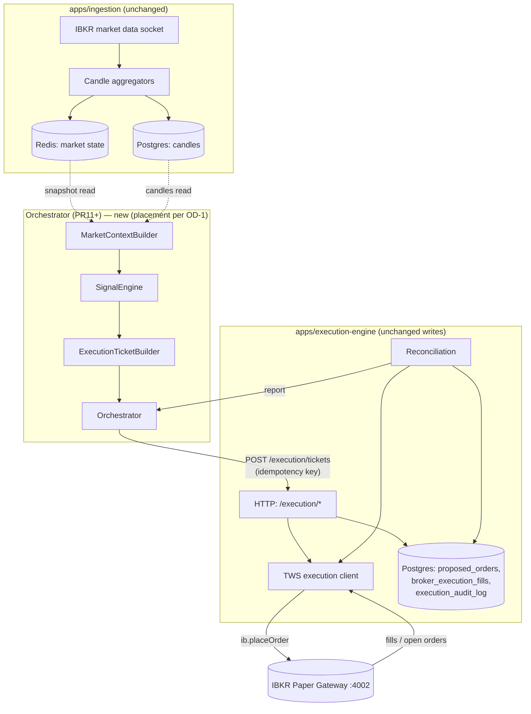

# Runtime Flow — Phase 2

> One diagram, one owner-per-box, explicit sync/async boundaries.
> Types are documented in
> [../../architecture/](../../architecture/) — not repeated here.

## End-to-end diagram

## Component responsibilities

| Component | Owns | Never does |
| --- | --- | --- |
| `apps/ingestion` | Market data socket, candle persistence, Redis cache | Places orders, evaluates strategies |
| `MarketContextBuilder` | Deterministic snapshot assembly from candles + cache | Fetches data, mutates state |
| `SignalEngine` | Orchestrates Decision + Risk into a `SignalEvaluation` | Talks to broker or LLM |
| `ExecutionTicketBuilder` | Turns a `GENERATED` signal into a deep-frozen ticket | Persists, submits, retries |
| **Orchestrator** (new, PR11+) | Runs the pipeline, holds idempotency key, submits ticket to `execution-engine`, tracks in-flight requests, reacts to reconciliation | Calls IBKR directly, holds broker session, runs LLM |
| `apps/execution-engine` | Only writer to IBKR. Persists `proposed_orders`. Runs reconciliation. Emits alerts | Contains strategy or AI logic |
| `apps/llm-agent` | Autonomous EXECUTE/REJECT gate for `PROPOSED` orders (existing) | Bypass Risk Engine or proposal flow |

## Module boundaries

- Shared library (`packages/shared`): pure. No `pg`, no `ib`, no `fs`,
  no timers except injected `now()`.
- Orchestrator process: allowed HTTP client to `execution-engine`,
  allowed Postgres *read* on candles, allowed Redis *read* on
  market state. **No** direct `ib` import, **no** Postgres writes.
- `execution-engine`: sole holder of the broker session and the sole
  writer of `proposed_orders`, `broker_execution_fills`,
  `execution_audit_log`.

## Sync vs async

| Hop | Mode | Notes |
| --- | --- | --- |
| Ingestion → Postgres/Redis | async, continuous | Existing. |
| Trigger → Orchestrator run | async, event-driven | Candle-close / scheduler tick. See OD-5. |
| Snapshot assembly → Signal → Ticket | **sync** in-process | Deterministic, no I/O, ~ms budget. |
| Orchestrator → `execution-engine` `POST /execution/tickets` | sync HTTP with strict timeout | See [FAILURE_AND_RECOVERY.md](FAILURE_AND_RECOVERY.md). |
| `execution-engine` → IBKR `placeOrder` | async at broker level | Order status flows back over the same socket. |
| Broker → fills / open-order updates | async push | Already handled by `tws-execution-client`. |
| Reconciliation → Orchestrator | async pull | Orchestrator polls a lightweight report endpoint. |

The Orchestrator's HTTP call is treated as a *ticket handoff*,
not a broker submission. A `2xx` from `execution-engine` means
"we accepted responsibility for this ticket and recorded intent"
— not "the order is live at the broker". Broker-live is observed
asynchronously via reconciliation and existing status updates.

## Where Phase 2 does NOT change flow

- `apps/signal-engine` legacy pipeline keeps running in parallel
  during PR12–PR16. Its outputs also land in `proposed_orders`.
  Deduplication relies on strategy identity + idempotency key
  (PR13) so the two pipelines cannot double-submit.
- `apps/llm-agent`, `apps/ui`, `apps/backtest-engine`,
  `apps/ingestion` are untouched by Phase 2 except for read paths
  (UI already reads `proposed_orders`).

## OPEN DECISIONS

- OPEN DECISION (OD-1): Orchestrator process placement — new
  dedicated app, module inside `apps/signal-engine`, or a third
  option. The kit does **not** assume `apps/orchestrator` exists.
  - **Resolved for PR12 (Market Data Runtime)** — hosted inside
    `apps/signal-engine/src/runtime/` as an isolated module. See
    [../../architecture/MARKET_DATA_RUNTIME.md](../../architecture/MARKET_DATA_RUNTIME.md)
    for the rationale (reuses existing Fastify + Redis + Postgres
    wiring; legacy `runAndPersist` pipeline untouched).
  - **Still open for PR13 (Execution Runtime).** The write edge
    may warrant its own lifecycle. Resolved before PR13.
- OPEN DECISION (OD-4): Does the Orchestrator call the existing
  `POST /execution/execute-ticket` endpoint with a mandatory
  `proposedOrderId`, or a new `POST /execution/tickets` endpoint?
  Resolved before PR13.
- OPEN DECISION (OD-5): Scheduler ownership — internal cron in
  Orchestrator or event-driven from candle-close in `ingestion`?

OUT OF SCOPE for this document: modify / cancel / partial-close
flows (Phase 3 in [main ROADMAP.md](../ROADMAP.md)).
