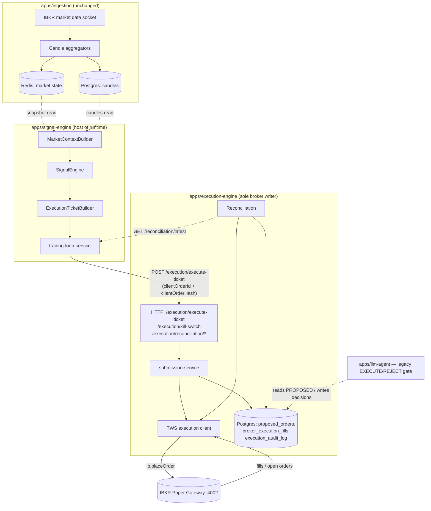

# Runtime Flow — Phase 2

> Status (r2, PR15 shipped as commit `87eff1c`): the earlier
> orchestrator-as-separate-process narrative is superseded.
> PR11–PR15 shipped the runtime as an in-process module inside
> `apps/signal-engine/src/runtime/`, still **entry-only**. The
> legacy `apps/llm-agent` EXECUTE/REJECT gate continues to run
> outside the new pipeline against `PROPOSED` orders (unchanged).

## End-to-end diagram

## Component responsibilities

| Component | Owns | Never does |
| --- | --- | --- |
| `apps/ingestion` | Market data socket, candle persistence, Redis cache | Places orders, evaluates strategies |
| `MarketContextBuilder` | Deterministic snapshot assembly from candles + cache | Fetches data, mutates state |
| `SignalEngine` | Orchestrates Decision + Risk into a `SignalEvaluation` | Talks to broker or LLM |
| `ExecutionTicketBuilder` | Turns a `GENERATED` signal into a deep-frozen ticket | Persists, submits, retries |
| `signal-engine/src/runtime/execution` | Submits tickets to `execution-engine`; holds `clientOrderId + clientOrderHash`; classifies outcomes | Calls IBKR directly, holds broker session, runs LLM, manages exits |
| `signal-engine/src/runtime/trading-loop` | Internal scheduler that drives the entry-only loop | Owns state beyond the tick; performs exit management (PR16) |
| `apps/execution-engine` | Only writer to IBKR. Persists `proposed_orders`. Runs reconciliation. Emits alerts | Contains strategy or AI logic |
| `apps/llm-agent` | Autonomous EXECUTE/REJECT gate for `PROPOSED` orders (legacy path, unchanged) | Bypass Risk Engine or proposal flow |

## Module boundaries

- Shared library (`packages/shared`): pure. No `pg`, no `ib`, no
  `fs`, no timers except injected `now()`.
- `signal-engine/runtime`: HTTP client to `execution-engine`,
  Postgres read on candles, Redis read on market state. **No**
  direct `ib` import, **no** Postgres writes to execution tables.
- `execution-engine`: sole holder of the broker session and the
  sole writer of `proposed_orders`, `broker_execution_fills`,
  `execution_audit_log`.

## Sync vs async

| Hop | Mode | Notes |
| --- | --- | --- |
| Ingestion → Postgres/Redis | async, continuous | Existing. |
| Trigger → trading-loop tick | async, timer-driven | `TRADING_LOOP_INTERVAL_MS`. |
| Snapshot → Signal → Ticket | **sync** in-process | Deterministic, no I/O, ~ms budget. |
| runtime → `POST /execution/execute-ticket` | sync HTTP with strict timeout | See [FAILURE_AND_RECOVERY.md](FAILURE_AND_RECOVERY.md). |
| `execution-engine` → IBKR `placeOrder` | async at broker level | Order status flows back over the same socket. |
| Broker → fills / open-order updates | async push | Handled by `tws-execution-client`. |
| Reconciliation → runtime | async pull | `GET /execution/reconciliation/latest` + `/holds`. |

The runtime's HTTP call is a **ticket handoff**, not a broker
submission. A `2xx` from `execution-engine` means "we accepted
responsibility and recorded intent" — not "the order is live at
the broker". Broker-live is observed via reconciliation and
existing status updates.

## Idempotency (PR15)

- Every ticket carries `clientOrderId + clientOrderHash` in the
  JSON body of `POST /execution/execute-ticket`. There is no
  `Idempotency-Key` header.
- On duplicate submissions, the server replies HTTP 200 with
  `duplicate: true` and one of
  `outcome: DUPLICATE_SUBMITTED | DUPLICATE_TERMINAL |
  DUPLICATE_PENDING_AMBIGUOUS | PENDING_CLAIMED`.
- Ambiguous rows stay `PROPOSED` with the persisted plan and the
  ambiguous marker; recovery is reconciliation-driven, not a
  client-side re-query.

## Entry-only scope (PR15)

- The trading-loop performs entries only. Exit management (SL/TP
  updates, cancels, partial closes) lands in PR16.
- Every `Instrument` in
  `packages/shared/src/instruments/definitions.ts` has
  `executionEnabled: false` by default (RiskEngine rejects with
  `INSTRUMENT_DISABLED`), and `TRADING_LOOP_ENABLED=false`.
- Enabling any instrument or turning the loop on is a deliberate
  operator action, tracked under PR15.2 / PR15.3.

## Where Phase 2 does NOT change flow

- `apps/llm-agent`, `apps/ui`, `apps/backtest-engine`,
  `apps/ingestion` are untouched by Phase 2 except for read paths.

OUT OF SCOPE for this document: modify / cancel / partial-close
flows (Phase 3 in [main ROADMAP.md](../ROADMAP.md)) and exit
management (PR16).
